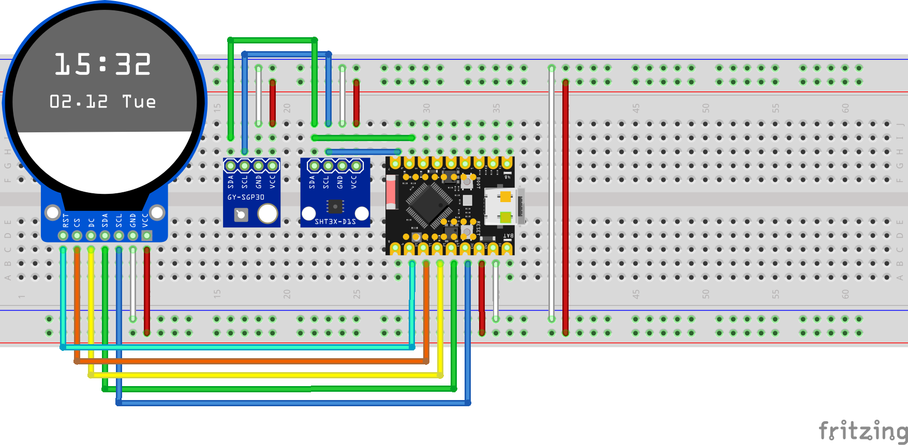

# EnvironmentMonitoring
Environment Monitoring for reading air quality, temperature and humidity.

Parts
 * ESP32-C6-SuperMini devboard (1x)
 * GC9A01 1.28 Inch TFT Display (1x)
 * ENS160+AHT21 Air Quality Sensor (1x)
 * USB Whip for power connection (1x)
 
